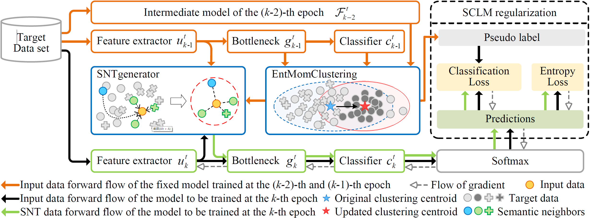

# SCLM

Code (pytorch) for **Semantic Consistency Learning on Manifold for Source Data-absent Unsupervised Domain Adaptation** on Office-31, Office-Home, VisDA-C. This article have been accepted by Neural Networks.

### Framework



### Preliminary

You need to download the [Office-31](https://drive.google.com/file/d/0B4IapRTv9pJ1WGZVd1VDMmhwdlE/view), [Office-Home](https://drive.google.com/file/d/0B81rNlvomiwed0V1YUxQdC1uOTg/view), [VisDA-C](https://github.com/VisionLearningGroup/taskcv-2017-public/tree/master/classification) dataset,  modify the path of images in each '.txt' under the folder './data/'.

The experiments are conducted on one GPU (NVIDIA RTX TITAN).

- python == 3.7.10
- pytorch ==1.6.0
- torchvision == 0.7.0


### Training and evaluation

1. First training model on the source data,  Office-31 dataset is shown here.

> ```
> cd ./object
> python SCLM_source.py --trte val --da uda --gpu_id 0  --output Office31/r0/src/ --dset office --max_epoch 100 --s 0 --seed 2020
> ```

2. Then adapting source model to target domain, with only the unlabeled target data.

> ```
> python SCLM_target.py --da uda --gpu_id 0 --cls_par 0.3 --cls_snt 0.1 --s 0 --t 1  --output_src Office31/r0/src/ --output Office31/r0/sclm/  --dset office --lr 1e-2 --net resnet50 --seed 2020
> ```

Please refer to **./object/run.sh** for all the settings for different methods and scenarios.

### Results


*All results of SCLM on three datasets is under the folder './results/'.*

### Acknowledgement

The code is based on [DeepCluster(ECCV 2018)](https://github.com/facebookresearch/deepcluster) and [SHOT (ICML 2020, also source-free)](https://github.com/tim-learn/SHOT).

### Contact

- tntechlab@hotmail.com


